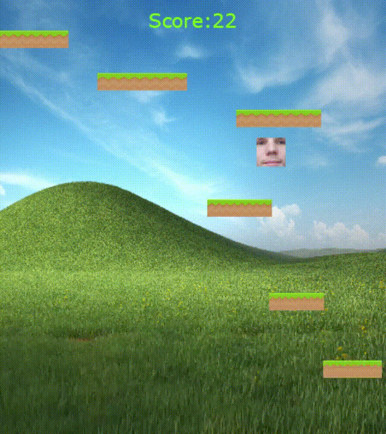

### Platformer

A very basic platformer game I made using the pygame library and following 
[this](https://coderslegacy.com/python/pygame-platformer-game-development/) tutorial.

The game is very simple so far:
* Jump higher to earn a higher score
* Every 10th platform passed increases score by 1
* Every glass of milk collected increases score by 10

And that's it for now!

---

TODO:
- [ ] Fix occasional jank when new platforms are generated
- [ ] Add possibility to jump down from a platform using the down arrow key
- [ ] Make platforms disappear some time after the player lands on them to make the game a bit harder
- [ ] Add a start menu and exit screen
  - [ ] Add option to choose character (i.e. have a different picture)
- [ ] Disallow the player to jump through the bottom of platforms, making the game much harder (?)
- [ ] Add a double jump (?)
- [ ] Add some way of spending accumulated score/money
- [ ] Make the game harder as score increases
  - [ ] Make platforms smaller as score increases
  - [ ] Make platforms move faster as score increases

BUGS:
- [x] If platform threshold is set to 10, occasionally there will be a gap between platforms too big to jump. Setting 
it to 20 solves this but makes the game freeze sometimes due to there not being any suitable positions for platforms - 
Fixed by redoing platform generation logic. Instead of always spawning new platforms at y=0 (the top of the screen), we 
now generate them some random distance above the current highest platform. This also eliminates occasional lag from 
trying to generate the same platform many times until finding a suitable spot    